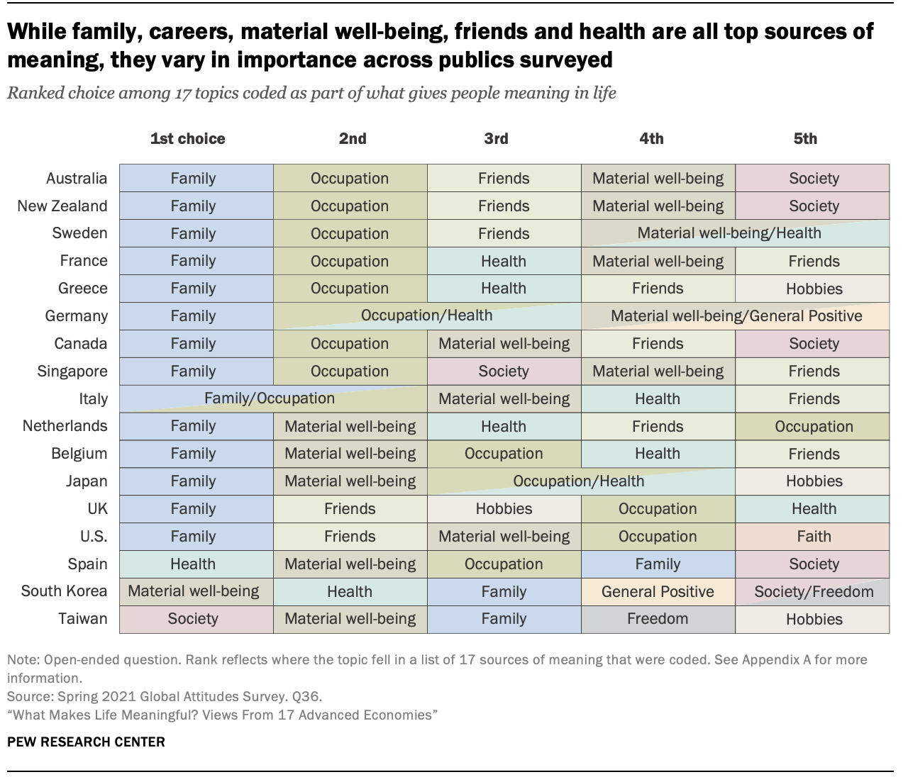

# hw-05

For any exercise where you’re writing code, insert a code chunk and make
sure to label the chunk. Use a short and informative label. For any
exercise where you’re creating a plot, make sure to label all axes,
legends, etc. and give it an informative title. For any exercise where
you’re including a description and/or interpretation, use full
sentences. Make a commit at least after finishing each exercise, or
better yet, more frequently. Push your work regularly to GitHub, and make sure 
all checks pass.

## Question 1

**Key lyme pie.** The goal of this exercise is to recreate a pie
    chart in R and then improve it by presenting the same information as
    a bar graph. The pie chart to be recreate is below and it comes from
    the Lyme Disease Association. (Source:
    [https://lymediseaseassociation.org/resources/2018-reported-lyme-cases-top-15-states](https://lymediseaseassociation.org/resources/2018-reported-lyme-cases-top-15-states/).)

Below are the steps I recommend you follow and some guidance on what
    (not) to worry about:

-   First, create the data frame: Use the annotations in the
        visualization provided to do this. You should create the new
        data frame using the `tibble()` or the `tribble()` functions.

-   Then, recreate the pie chart: When recreating the pie chart **you do not need to**

  -   make it a 3D pie chart (2D is sufficient)
  -   match the colors (default ggplot2 colors or any other color palette is fine)
  -   annotate the plot in the same way (just the legend is sufficient)
  -   match the entire caption (see below for what we want you to match)

- **However you should**,

  -   make a 2D pie chart
  -   present a legend on the right that shows the mapping of the colors to states
  -   match the title text, location, and alignment
  -   match the text, location, and alignment of the first two
            lines of the caption

-   Finally, improve the visualization by presenting this
        information in the form of a bar graph. And as an additional
        challenge, imagine you’re working for the state of Connecticut,
        so highlight that bar corresponding to that state in some way.
        Write a sentence or two describing why you chose to highlight
        the Connecticut info the way you did.

------------------------------------------------------------------------

Use the following prompt for Questions 2-5.

**Meaning of life.** A 2021 Pew Research survey of 18,850 adults from 17
advanced economies (Canada, Belgium, France, Germany, Greece, Italy, the
Netherlands, Spain, Sweden, the United Kingdom, the United States,
Australia, Japan, New Zealand, Singapore, South Korea and Taiwan) asked
the following question: “We’re interested in exploring what it means to
live a satisfying life. What aspects of your life do you currently find
meaningful, fulfilling or satisfying?” The results of the survey are
summarized in the following visualization, which can be found on [Pew’s
summary of their
findings](https://www.pewresearch.org/global/2021/11/18/what-makes-life-meaningful-views-from-17-advanced-economies/).

## Question 2

**The data.** Create a dataset based on the data presented in this
    visualization. You will want to take a peek at the next question,
    since the dataset you create / how the data are organized will
    depend on the type of visualization you might make in the next
    question.

- The code to create the data should go in the `data/data-create.R`
  file.
- The dataset should be called `life_meaning` and saved as
  `life_meaning.csv` in the data folder.

## Question 3

**The visualization.** Create an alternative visualization of these
    data. Accompany your visualization with a brief explanation of how
    you decided to create what you created, as well as how it is similar
    to and how it differs from the original visualization. It’s OK if
    your visualization is such that all the conclusions that can be
    drawn from the original visualization can’t be drawn from yours
    (e.g., maybe fewer choices per country are displayed), but this
    should be something you articulate in your answer along with a
    justification with why you think it’s OK to omit this feature. Make
    sure that your visualization employs accessibility best practices
    we’ve discussed in class, and write a sentence about features you’ve
    decided to include/omit to meet these guidelines. The code to make
    the visualization should go in your Quarto file (as usual).

## Question 4

**The app.** Create a Shiny app that features the visualization you
    made and at least one reactive element. The reactivity can be as
    simple as selecting a country to highlight. Deploy the app to
    shinyapps.io.

- The code of the app should go in the `app1` folder.
- The link to the deployed app should be included in your R Markdown
  folder.
- If you have a dataset you’ve created and placed in the `data` folder
  in the root of your project/repo, move that data file into the
  `app1/data` folder. You need everything needed to run the app in the
  `app1` folder for deployment. This creates multiple copies of the data
  in your repo, but that’s ok. If you don’t have a dataset
- Note: You’ve learned about Shiny in class, but we haven’t covered
  deployment, so completing this question will require a bit of
  self-learning. See [this article on
  deployment](https://shiny.rstudio.com/articles/shinyapps.html) for
  instructions) for instructions for deployment to shinyapps.io, and ask
  questions if you need further guidance!

## Question 5

**The styled app.** Change the look of your app using the theming
    features and the auto-theming option offered by the
    [thematic](https://rstudio.github.io/thematic) package. This will
    allow the look of your app to match the look of your visualization.
    Deploy the app to Shinyapps.io.

- The code of the app should go in the `app2` folder.
- The link to the deployed app should be included in your R Markdown
  folder.
